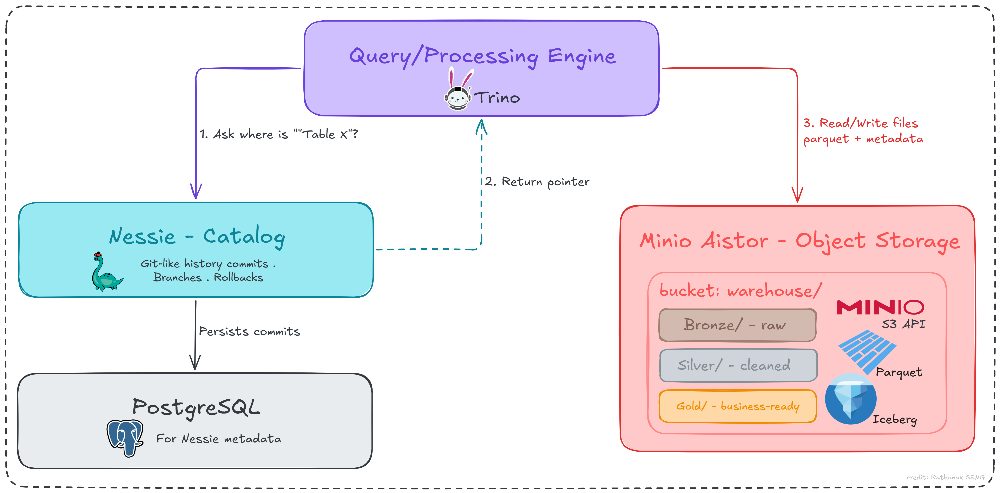

# Pair 2 — Medallion Architecture Storage

The first build pair of the series. It stands up the storage foundation that every later pair sits on top of: an object store, a table format with ACID guarantees, a catalog, and a SQL engine for verification. The medallion pattern (Bronze, Silver, Gold) is expressed as Iceberg namespaces inside a single `warehouse` bucket, which keeps the storage layout aligned with the theory post.

## Posts

- **Theory:** Bronze, Silver, Gold: why your data needs three zones. [Read on Medium →](https://medium.com/@withrathanak/bronze-silver-gold-why-your-data-needs-three-zones-6b971b0b2a76)
- **Project:** Build a lakehouse storage layer with Iceberg, Parquet, and MinIO AIStor. [Read on Medium →]()

## Architecture


*Figure 1. Data lakehouse storage architecture.*

## Tools by layer

| Layer | Tool | Role |
|---|---|---|
| Object storage | MinIO AIStor | Holds all table data and Iceberg metadata files |
| Table format | Apache Iceberg on Parquet | ACID tables, schema evolution, snapshot-based time travel |
| Catalog | Project Nessie | Iceberg REST catalog with Git-style commits and branches |
| Catalog metadata store | PostgreSQL | Backing database for Nessie commit history |
| Query engine | Trino | SQL access for creating namespaces, tables, and verification |

## How to run it

### 1. One-time shared network

Later compose files in the series join the same network.

```bash
docker network create lake-net
```

### 2. AIStor license and directories

Request a free AIStor license and place it where Compose expects it.

```bash
cd project/datalakehouse/
mkdir -p aistor/data
# place the license file at ./aistor/minio.license
mkdir -p nessie/pgdata
```

### 3. Secrets

```bash
cp .env.example .env
```

Edit `.env`. The Trino catalog keys must match `LAKE_USER` and `LAKE_PASSWORD`.

### 4. Bring it up

```bash
docker compose -f docker-compose.data-lakehouse.yml up -d
```

### 5. Create the medallion namespaces and a first table

```bash
docker exec -it trino trino
```

```sql
CREATE SCHEMA lakehouse.bronze;

CREATE TABLE lakehouse.bronze.food_prices (
  price_date    DATE,
  admin1        VARCHAR,
  admin2        VARCHAR,
  market        VARCHAR,
  market_id     INTEGER,
  latitude      DOUBLE,
  longitude     DOUBLE,
  category      VARCHAR,
  commodity     VARCHAR,
  commodity_id  INTEGER,
  unit          VARCHAR,
  priceflag     VARCHAR,
  pricetype     VARCHAR,
  currency      VARCHAR,
  price         DOUBLE,
  usd_price     DOUBLE
);

INSERT INTO lakehouse.bronze.food_prices VALUES
 (DATE '2003-01-15','Battambang','Battambang','Battambang',639,13.1,103.2,
  'cereals and tubers','Rice (mixed, low quality)',165,'KG','actual','Wholesale','KHR',500,0.13);

-- prove it: current rows, then the snapshot history that gives you time travel
SELECT * FROM lakehouse.bronze.food_prices;
SELECT committed_at, snapshot_id FROM lakehouse.bronze."food_prices$snapshots";
```

## Dataset

World Food Programme, *Cambodia Food Prices*, via the Humanitarian Data Exchange: [data.humdata.org/dataset/wfp-food-prices-for-cambodia](https://data.humdata.org/dataset/wfp-food-prices-for-cambodia). Sourced from AMO-MAFF (Cambodia Agricultural Market Information System) and FAO GIEWS. Licensed CC BY-IGO.

## Reference

Armbrust et al., *Lakehouse: A New Generation of Open Platforms that Unify Data Warehousing and Advanced Analytics*, CIDR 2021.